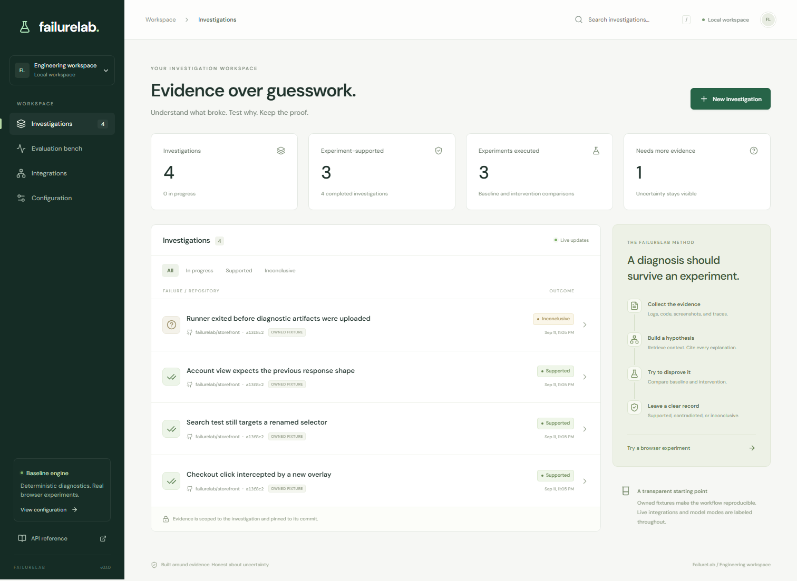
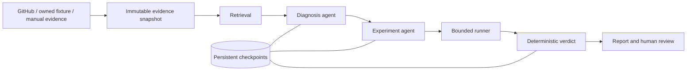

# FailureLab

FailureLab is a CI investigation workspace. It retrieves evidence, proposes causes,
and runs controlled browser experiments before supporting a finding.



## Run it

Requirements: Python 3.11+, Node.js 22+, [uv](https://docs.astral.sh/uv/).
No API key is needed for the owned browser lab.

```powershell
cd G:\Desktop\failurelab
.\scripts\start.ps1
```

Linux/macOS: `bash scripts/start.sh` (the Chromium OS dependency installer may
request administrator access on Linux). Open **http://127.0.0.1:8787**.

Manual setup:

```sh
uv sync --frozen --extra dev
uv run playwright install chromium
cd frontend
npm ci
npm run build
cd ..
uv run failurelab evaluate
uv run failurelab serve
```

The app seeds four owned incidents once. The worker runs Chromium experiments
for an overlay, a selector change, and an API response mismatch. A fourth incident
demonstrates abstention when artifacts are missing. Startup takes a few seconds
while browser runs finish. Incidents, evidence, screenshots, traces, checkpoints,
reviews, and results persist under `var/`.

## What works

- Responsive investigation dashboard with filtering, search, direct links, and live status.
- Source evidence viewer with hashes, log lines, screenshots, and GitHub source links.
- Two LangGraph agent stages: diagnosis and experiment planning, followed by executable verification.
- Explicit deterministic baseline and configurable live model inference with structured output validation.
- BM25 + exact identifier retrieval; optional real embeddings and cross-encoder reranking.
- Real, interleaved baseline/intervention browser runs, preserved screenshots and Playwright traces.
- PostgreSQL-capable job storage, SQLite local defaults, persistent LangGraph checkpoints,
  leased jobs, heartbeat renewal, bounded retries, and idempotent events/results.
- GitHub run import, HMAC-validated webhooks, bounded logs/artifacts/commit ingestion,
  repository allowlists, credential-free storage redirects, and npm version lookup.
- A separately deployable Linux repository runner with reviewed manifest hashes.
- Human reviews, JSON/Markdown export, model usage/version records, and an evaluation dashboard.
- API, integration-contract, crash recovery, real-browser, and responsive UI tests.

## Modes are explicit

**Baseline** uses deterministic diagnostic signatures without an LLM. It executes
local browser experiments on synthetic examples. **Chat** uses a real model provider.
Provider errors stop the workflow; the system never silently substitutes the baseline.
The model never assigns the final experimental status.

Copy `.env.example` to `.env` to configure integrations. Empty optional values use
their documented defaults. Secrets remain server-side and `.env` is Git-ignored.

For real inference through Hugging Face or a compatible endpoint:

```dotenv
FAILURELAB_MODEL_MODE=chat
FAILURELAB_MODEL_BASE_URL=https://router.huggingface.co/v1
FAILURELAB_MODEL_NAME=<a chat model available from your selected provider>
FAILURELAB_MODEL_API_KEY=<your provider token>
FAILURELAB_MODEL_VISION=true
```

Enable vision only for models that support image inputs. Model availability depends
on the provider; the example model identifier is a candidate, not a hosting guarantee.
The adapter sends at most one retained PNG plus bounded text context. Model responses
must match the diagnosis/plan schemas and cite retrieved evidence IDs.

Optional neural retrieval:

```sh
uv sync --extra dev --extra ml
```

```dotenv
FAILURELAB_RETRIEVAL_MODE=hybrid
```

This downloads `BAAI/bge-small-en-v1.5` and a MiniLM cross-encoder on first use.
The models support CPU inference. The app keeps lexical retrieval and vector search
distinct in its labels.

## Verify

Build the frontend before running UI acceptance tests.

```sh
uv run ruff check src tests
uv run pytest --cov=failurelab --cov-report=term-missing
uv run failurelab evaluate --min-accuracy 0.8
uv run failurelab doctor
```

`pytest -m 'not browser'` runs the fast suite. `pytest -m browser` runs actual browser
interventions plus desktop/mobile acceptance tests. The acceptance tests start their
own API and database on a random local port. They do not alter the user's workspace.

The evaluation dashboard reads measured output from `var/evaluation.json`. Its
16-case authored signature regression set is **not a held-out production benchmark**.
Read [evaluation methodology](docs/evaluation.md) before interpreting its scores.

## Architecture and operations



- [Architecture and design decisions](docs/architecture.md)
- [Deployment, backups, recovery, and scaling](docs/deployment.md)
- [GitHub and model integration setup](docs/integrations.md)
- [Isolated repository runner protocol](docs/runner-protocol.md)
- [Evaluation methodology and failure cases](docs/evaluation.md)
- [Data provenance and research sources](DATA_SOURCES.md)
- [Security model](SECURITY.md)
- [Portfolio walkthrough](docs/portfolio.md)
- [Executed verification and measured limits](docs/verification.md)
- [GitHub security and quality automation](docs/github-automation.md)
- Interactive API reference: `/docs`; OpenAPI specification: `/openapi.json`.

## Boundaries

This is a single-workspace application, not a multi-tenant SaaS. Bearer authentication
protects a workspace; it does not provide individual user identities or role-based
authorization. Never share a deployment between mutually untrusted teams.

The local runner executes only application-owned static fixtures. It never executes
an imported repository. The external runner requires a disposable Linux VM and an
operator-reviewed repository manifest; Docker alone is not the security boundary.
Human review records do not automatically merge code or send messages.

Live provider inference, remote repository execution, PostgreSQL deployment, and
Docker deployment require the corresponding credentials/infrastructure. The local
verification report distinguishes tests executed here from these integration paths.

## Repository map

```text
src/failurelab/      API, workflow, agents, retrieval, storage, integrations, runners
frontend/           React + TypeScript interface
tests/              Unit, API, integration-contract, recovery, and browser tests
docs/               Architecture, operations, evaluation, screenshots, provenance
examples/           Reproduction manifest and GitHub artifact upload configuration
scripts/            Cross-platform startup commands
var/                Ignored runtime database, checkpoints, evidence, evaluation
```

MIT licensed. The license applies to project-owned code and fixtures, not imported
third-party repository content. External data retains its original terms.
