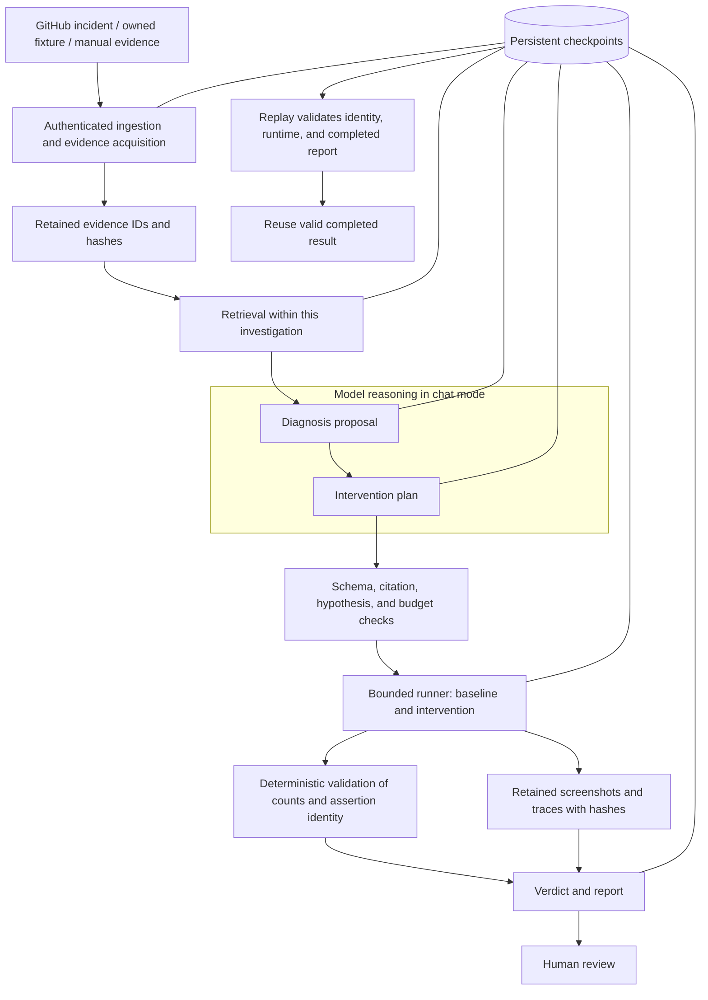

# Architecture

## Investigation and control boundaries

FailureLab separates model proposals from permission to execute and from the
experimental verdict. The two agents are stages in one LangGraph workflow. They
receive bounded evidence and return typed data; they cannot execute a shell or
approve a release.

| Boundary | Enforced by the application | Evidence or limitation |
|---|---|---|
| Evidence | Snapshot, bounded collection, retrieved citation IDs | Source and artifact hashes identify retained content |
| Model reasoning | Structured diagnosis/plan contracts; unknown cannot authorize experiments | Chat uses a provider; baseline uses explicit signatures |
| Actions | Allowlisted interventions and counts; external runner authentication and reviewed manifest | Imported code requires a disposable Linux VM |
| Validation | Same assertion identity; verdict recomputed from recorded counts | Support applies to the tested mechanism and environment |
| Persistence | Leases, checkpoints, idempotent results and events | Completed replay returns the stored report; invalid state stops execution |
| Release | Separate tests, live acceptance, deployment checks, and human review | A supported case does not satisfy the release gate by itself |

The local runner accepts only application-owned fixtures. The external runner
executes a pinned repository through an operator-reviewed harness; the model chooses
an action name, while that harness defines its effect. See the
[runner protocol](runner-protocol.md) for the VM boundary and manifest contract.

## Workflow

An ingestion request creates an investigation and snapshots its evidence. The
transactional store deduplicates GitHub deliveries by repository, run, and attempt.
A worker claims a queued case with a compare-and-swap update. The lease renews every
20 seconds; an abandoned lease becomes eligible for recovery. Three infrastructure
attempts are allowed before explicit manual retry.

The LangGraph sequence is `collect → retrieve → diagnose → plan → execute → report`.
The workflow uses SQLite checkpoints locally and selects PostgreSQL checkpoints when
the database URL is PostgreSQL. A restarted worker reads the same investigation thread
and resumes from its last checkpoint. Events have unique stage keys. Owned experiment
results are atomically written and reused when a node replays.

If a failure occurs after an external operation but before the checkpoint commits,
recovery can replay that operation. External runners receive idempotency keys to
handle these replays. This is at-least-once execution with idempotent effects, not a
claim of universal exactly-once execution.

## Agents and retrieval

The diagnosis agent receives only this investigation's evidence, never a global
unfiltered corpus. GitHub code comes from the failing commit. BM25 and exact identifiers
provide the default ordering. Optional dense cosine retrieval contributes a second
ranking through reciprocal rank fusion; a cross-encoder reranks the candidates.
Models load lazily and are cached per process. Evidence IDs and content hashes remain
stable as ranking changes.

The experiment agent proposes an allowlisted intervention with bounded repetitions.
Pydantic validates hypotheses, citation IDs, experiment references, counts, and tool
names. A generated `supported` status is discarded before verification. Document
instructions are untrusted content; the model has no shell tool.

The baseline engine recognizes explicit failure signatures in logs. It uses a simple
approach, labeled in every report. Retrieval and screenshot adapters are implemented,
but the baseline does not interpret pixels. Chat mode can send a screenshot to a
vision-capable provider.

## Verification

Owned fixtures use static HTML and fixed application-owned interventions. Network
requests are blocked. Each condition receives a fresh browser context. Baseline and
intervention runs are interleaved, with identical viewport and browser version.
Screenshots and traces are captured for the first pair.

A mechanism is supported only when all baseline runs fail and all intervention runs
pass. An ineffective intervention with consistently failing runs contradicts the
specific tested intervention; it does not disprove every variant of the broad cause.
Mixed results, successful baselines, and repeat-baseline experiments are inconclusive.
Unavailable external execution never becomes a successful or failed experiment.

This controlled comparison is evidence of a mechanism under the recorded environment,
not proof of unique causality. Small sample counts do not establish flaky-test rates.

## Persistence and interfaces

SQLAlchemy stores investigations, append-only events, and reviews. JSON payloads keep
the initial model simple and portable. Artifact names are generated and constrained;
archive paths are never extracted. Evidence content is redacted before hashing and
storage. Hashes identify the retained redacted snapshot, not the upstream unredacted file.

The UI uses the same-origin API, polls live cases, and maintains a case ID in the URL.
It renders content as text, fetches authenticated image blobs, and exports versioned
reports. Reviews append an opinion without rewriting evidence or experimental outcomes.

## Failure classification and replay

HTTP/transport failures raise `ProviderUnavailable` and record a sanitized
`provider_error` event. HTTP 402 therefore remains `provider_unavailable`, with no
accepted diagnosis, fallback, or abstention credit for the failed stage. Invalid
provider output raises `AgentOutputError`. A schema-valid but wrong diagnosis is
assessed separately by the acceptance scorer; it is not an HTTP failure.

| Observation | Recorded handling |
|---|---|
| Provider HTTP/transport error | Worker category `provider_unavailable`; status and duration retained without response bodies or private headers |
| Invalid schema, citation, or plan | Worker category `agent_failed`; execution is not authorized |
| Completed investigation fails expected live acceptance | Harness classification `agent_failed`; original report preserved |
| Other worker/application/infrastructure exception | Worker category `execution_failed`; harness uses `test_harness_failed` for an unclassified failed case |
| Unavailable external execution | Experiment `unavailable`; finding stays `inconclusive` |
| Real browser failure or ineffective intervention | Counts feed the deterministic verdict; no provider-error classification |

These categories do not independently diagnose every infrastructure fault. The
timeline, exception type, runner observations, and acceptance checks supply the
context needed to investigate an application or harness failure.

Calls are reserved before dispatch and counted from persistent events, including
failed requests. A pending checkpoint must match the recorded inference/retrieval
configuration and tool-schema hash. Completed replay requires matching investigation
identity and report data; a missing or corrupted checkpoint fails safely. A valid
completed checkpoint returns without updating the case timestamp or running stages.
The [release tests](../tests/test_release_gate.py) exercise these boundaries.

## Provenance and release evidence

Runtime checkpoints record the provider endpoint, configured model, prompt version,
retrieval configuration, and tool version/hash. Model events retain attempted calls,
provider-reported usage, returned model identifier, and error timing. Reports connect
evidence IDs to experiments and retained artifacts; the acceptance harness also
freezes input snapshots and implementation hashes before inference. These fields
span the checkpoint, event log, report, and acceptance record rather than one export.

Missing prices leave estimated cost unavailable. A model identifier is not an exposed
weights revision. Hashes identify bytes; they do not establish that a model's explanation
is correct. The [release evidence](validation/release-gate-results.json) preserves
partial runs alongside complete cases. Release readiness is assessed separately in
the [gate report](releases/v0.1.2-gate.md).

## Deliberate operational scope

The application has one workspace and one trust domain. SQLite supports the local
single-worker deployment. PostgreSQL supports separate API and worker processes, but
all workers must share artifact storage. The provided application uses a filesystem
artifact store; a shared
mounted volume is required for distributed workers. Database and filesystem backup
must be coordinated. No unmeasured million-document or high-concurrency claim is made.
