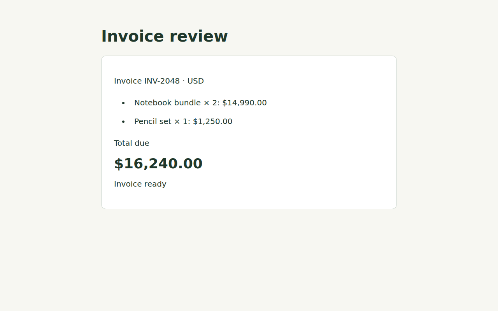
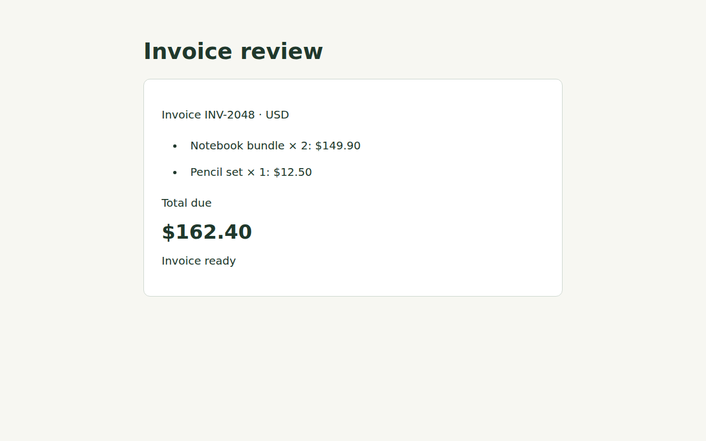
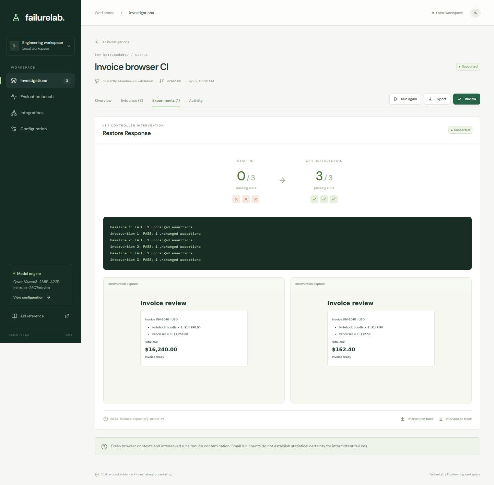

# Single-incident GitHub validation

On September 12, 2026, FailureLab imported a new invoice CI failure from GitHub,
retrieved its evidence, called both live agents, and executed browser experiments
on a disposable Linux VM. The successful attempt had baseline 0/3 and intervention
3/3, yielding a deterministic `supported` verdict with retained screenshots and traces.

This was an authored development case. Two earlier full attempts ended inconclusive;
the successful attempt followed a correction to the tool descriptions. All attempts
are recorded. This does not establish independent accuracy or generalization.

## Incident and frozen ground truth

The [MIT-licensed validation repository](https://github.com/MJA0211/failurelab-ci-validation)
contains a Node invoice API, browser client, and Playwright assertion. It was created
separately from FailureLab's four seeded incidents. No external application code was
copied; `@playwright/test` is Apache-2.0 licensed.

A [public Medusa report](https://github.com/medusajs/medusa/issues/14818) was reviewed
while looking for an independent example. It supplied a calculation snippet but no
linked reproduction repository or pinned failing CI suitable for this acceptance.
Its code and diagnosis were not model inputs. This exercise used the explicitly
permitted authored fallback.

| Field | Recorded value |
|---|---|
| Incident | `invoice-units-001` |
| Repository | `MJA0211/failurelab-ci-validation` |
| Commit | `92b61b0eb9a55a73886394979d66cc158f3a99e8` |
| Workflow / job | `Invoice browser CI` / `invoice` |
| Test | `invoice displays the agreed total` |
| Symptom | Expected `$162.40`; displayed `$16,240.00` |
| Root cause | The API serializes `amount_cents` as `price`; the client treats `price` as dollars |
| Relevant files | `src/api.js`, `src/app.js`, `tests/invoice.spec.js` |
| Verification | Convert prices at the response boundary while preserving the browser assertions |

The [baseline CI run](https://github.com/MJA0211/failurelab-ci-validation/actions/runs/34719385585)
failed. A separate [reference run](https://github.com/MJA0211/failurelab-ci-validation/actions/runs/34719386780)
passed the same assertion before model execution. Reference-run evidence was excluded
from ingestion.

The [ground-truth record](validation/invoice-ground-truth.json) was frozen before
model calls. Its SHA-256 is
`f9cd9a45def45c5c3f456b553cee57cbaabc400688f49696585ad9874d0782ce`.
The reviewed runner manifest hash is
`3a3a95010b05ad72f9f494e076f0d61404f254b82315247292dd5c193091badf`.
The ground truth and repair controls in `server.js` and `.failurelab/runner.json`
were never sent to the model. They are published after the investigation.

## GitHub ingestion and evidence

The actual GitHub client imported workflow metadata, the failed job log, the pinned
commit patch, selected application source, and uploaded browser evidence. The existing
allowlist, download/archive bounds, and credential-free storage redirects remained
enabled. No ingestion response was mocked.

The eight-item snapshot was checkpointed before diagnosis. Its recorded SHA-256 is
`877a0199101d5ccfd2ddf831d0639ff0b6dfe153f8b0299eec3eeaa5877e8b5d`.
All three full attempts used identical evidence and retrieval results. A leakage
check rejected ground-truth fields and repair-control strings before model execution.

| Evidence ID | Content |
|---|---|
| `e-run` | Actual failed workflow metadata |
| `e-job-103622314972` | Failed invoice job log |
| `e-code-0` | Investigation-time client patch |
| `e-artifact-10305483759-0` | Current API and client source |
| `e-artifact-10305483759-1-1` | Playwright trace log |
| `e-artifact-10305483759-1-2` | Playwright trace log |
| `e-artifact-10305483759-1-3` | Playwright network log |
| `e-artifact-10305483759-2` | Failed browser screenshot |

BM25 and exact-identifier retrieval returned all eight items. This case therefore
does not demonstrate filtering a larger corpus. The final diagnosis cited the first
trace log, network log, and API/client source. Those support the unit mismatch.
The model's arithmetic summary omits the first line's quantity of two; the actual
calculation is `7495 × 2 + 1250 = 16240` cents. Citation IDs were checked by the
application. Substantive citation review was performed by the assistant, not an
independent human reviewer.

## Live AI and comparisons

Calls used `Qwen/Qwen3-235B-A22B-Instruct-2507:novita` through
`https://router.huggingface.co/v1`, in chat mode with vision disabled. Comparisons
used the frozen snapshot. No correct diagnosis was manually supplied to an agent.

| Mode | Top-1 category | Mechanism assessment | Latency | Input / output tokens |
|---|---|---|---:|---:|
| Deterministic baseline | `unknown` | Did not identify the cause; abstained | 4 ms | No model calls |
| LLM with job/trace logs | `api_contract` | Identified units but also suggested formatting | 13,356 ms | 45,623 / 256 |
| LLM with retrieval | `api_contract` | Correct unit mismatch, supported by source | 11,519 ms | 46,820 / 241 |

These are single-incident observations, not benchmark percentages. Category correctness
alone is insufficient: the first full attempt selected `api_contract` but described
the wrong mechanism. Adding source context and ordering all eight items does not
establish a measured RAG uplift. Cost is unknown because no prices were configured.

| Full attempt | Prompt | Diagnosis and action | Experiment | Final finding |
|---|---|---|---|---|
| 1 | `failurelab-agents-v2` | Incorrect formatting explanation; `repeat_baseline` | 0/3 passes in both conditions | Inconclusive |
| 2 | `failurelab-agents-v2` | Correct unit mismatch; `repeat_baseline` | 0/3 passes in both conditions | Inconclusive |
| 3, after correction | `failurelab-agents-v3` | Correct unit mismatch; `restore_response` | Baseline 0/3; intervention 3/3 | Supported |

Attempt 2 was one bounded exploratory repeat after the first attempt disagreed with
the retrieval comparison. Attempt 3 was acceptance after correcting the tool contract.
Neither is an untouched held-out test. Both inconclusive verdicts were correct for
the non-intervening experiments, but neither established the known cause.
The [measurement record](validation/invoice-results.json) retains every attempt.

Attempt 3 made two successful calls: diagnosis took 6,797 ms and planning took
10,290 ms, consuming 93,876 input tokens and 356 output tokens in total. The report
recorded 86,819 ms from collection through completion, including Actions queue/setup
and transport. Runner execution took 20,250 ms. Attempt 1's 154,723 ms includes a
deliberate checkpoint pause and is not a clean latency comparison. No provider error
or model-call retry occurred during the three unfamiliar-incident attempts.

## Linux experiment

The [successful experiment workflow](https://github.com/MJA0211/failurelab-ci-validation/actions/runs/34720056503)
ran the actual runner service on `ubuntu-24.04`. A local acceptance bridge dispatched
the model-produced request and downloaded its result. Inside the VM, a real
authenticated HTTP request invoked the runner. The bridge did not invent results
or execute repository code on Windows.

The runner fetched the exact commit, checked the manifest and lockfile, installed
locked dependencies with lifecycle scripts disabled, and interleaved three condition
pairs. Playwright 1.58.2 used Chromium 145.0.7632.6. Each process ran the same assertion
identity with retries disabled. The agent chose the action; the reviewed harness
implemented it at the API response boundary.

FailureLab validated returned artifact hashes and recomputed the verdict from counts.
Repeating the runner HTTP request with the same idempotency key returned the cached
result. Missing credentials returned 401; an unreviewed repository returned 403.
Replaying the completed orchestrator checkpoint made no additional model call or
Actions job.





The original PNG/ZIP hashes are in the measurement record. Raw traces and runtime
databases remain under ignored `var/unfamiliar/`. GitHub artifacts have seven-day
retention. Reviewed PNGs are retained as documentation evidence.

GitHub documents a [fresh VM for standard hosted jobs](https://docs.github.com/en/actions/concepts/runners/github-hosted-runners).
This job blocked private/link-local destinations, used bounded commands and an
eight-minute job limit, and received no model-provider key. Browser traffic was
limited to the fixture's loopback origin. This verifies the reviewed owned repository
in that environment. It does not certify arbitrary untrusted repositories, strict
public egress isolation, a permanent private runner endpoint, or durable caching
across VM destruction. The deployment security policy remains unchanged.

## Report and webhook checks

Investigation `inv-bc1e08adab69` has JSON/Markdown exports and four downloadable
artifacts. Actual API downloads matched all hashes. The browser report, experiment
observations, export button, and direct-link reload passed. Human review is pending;
no review was recorded on the user's behalf.



A separate local HTTP replay used actual GitHub run metadata. The HMAC handler
rejected unsigned and tampered bodies with 401, accepted the signed body with 200,
and reused the case ID on duplicate delivery. This is local handler verification,
not a webhook delivered by GitHub to a public endpoint.

## Integration fixes

The repository runner discarded browser artifacts when removing its temporary
checkout. It now transfers bounded, hashed PNG/ZIP attachments. Regression tests
cover retention, paths outside the output directory, malformed payloads, oversized
responses, and replay. The client validates declarations, encoding, signatures, and
hashes before saving files. It strips transfer payloads from the final report.

The planner received action names without descriptions of their effects. The schema
now explains each reviewed action and why `repeat_baseline` cannot test causality.
Prompt version `failurelab-agents-v3` records the change. A contract test checks that
generic descriptions reach the provider without an invoice-specific answer. No
verdict was forced and no assertion was weakened.

The default model example now matches the model used in live verification. Version
fields and lockfile metadata are prepared for `0.1.2`.

## Verification and release

| Command | Result |
|---|---|
| `uv run ruff check src tests scripts` | Passed |
| `uv run ruff format --check src tests scripts` | Passed |
| `uv run pytest --cov=failurelab --cov-report=term-missing` | 130 passed in 78.75 s; 77% combined statement/branch coverage |
| `uv run failurelab evaluate --min-accuracy 0.8` | 16/16 authored baseline cases in both variants |
| `uv run failurelab doctor` | Local Chromium 151.0.7922.34 passed; configured mode `chat` |
| `uv run pytest -m "not browser"` | 120 passed, 10 deselected in 8.85 s |
| `uv run pytest -m browser` | 10 passed, 120 deselected in 66.43 s |
| `uv run pytest tests/test_agents.py tests/test_runner_artifacts.py tests/test_runner_service.py -q` | 33 passed |
| `npm run build` in `frontend/` | TypeScript/Vite production build passed |
| `npm audit` in `frontend/` | Zero known vulnerabilities |
| `npm run format:check` in `frontend/` | Passed after formatting the version fallback edit |
| `uv tool run pip-audit==2.10.1 --path .venv/Lib/site-packages --skip-editable` | No known vulnerabilities |
| `uv run python scripts/verify_unfamiliar_incident.py run --attempt 3` | Supported; completed-checkpoint replay matched |

Tests and baseline evaluation used an empty `FAILURELAB_ENV_FILE` to isolate developer
credentials. The doctor and live checks used `.env`. The Starlette/AnyIO test-client
deprecation warning remains.

The published four-fixture live check passed with prompt v2 after access was restored.
The final v3 check passed overlay and selector, then stopped on HTTP 402 during the
API-contract case. There was no deterministic substitution. The updated full check
remains incomplete, and the larger 16-case live evaluation has no completed score.
Further provider calls require available credit.

[PR #13](https://github.com/MJA0211/failurelab/pull/13) was merged with all required
checks passing. Version `0.1.2` is prepared on the validation branch. Release readiness
still requires completing the updated live check and reviewing the new PR. No
`v0.1.2` tag or release was created; existing tags were not changed.

[Draft PR #14](https://github.com/MJA0211/failurelab/pull/14) contains the validation
and integration fixes. The publication diff excludes `.env`, runtime databases,
checkpoints, raw traces, and the local portfolio document. Gitleaks reported one
finding: the SHA-256 value for `src/api.js` in the frozen ground truth. Recomputing
the file hash confirmed it is source provenance, not a credential. The record was
preserved, and no scanner rule was disabled.

## Reproduction

The script requires the configured model key and GitHub CLI permission to read the
fixture run and dispatch its reviewed experiment workflow. The model key stays local.
Use a new workspace name to preserve previous attempts:

```powershell
uv run python scripts/verify_unfamiliar_incident.py collect --workspace invoice-recheck
uv run python scripts/verify_unfamiliar_incident.py compare --workspace invoice-recheck
uv run python scripts/verify_unfamiliar_incident.py run --workspace invoice-recheck
```

After artifacts expire, the repository owner can dispatch another baseline at the
same pinned commit and supply its run ID with `--run-id` on each command. A different
commit is rejected. Reference-profile evidence and ground truth must remain excluded.
This bridge is specific to the reviewed fixture, not a general execution service.
